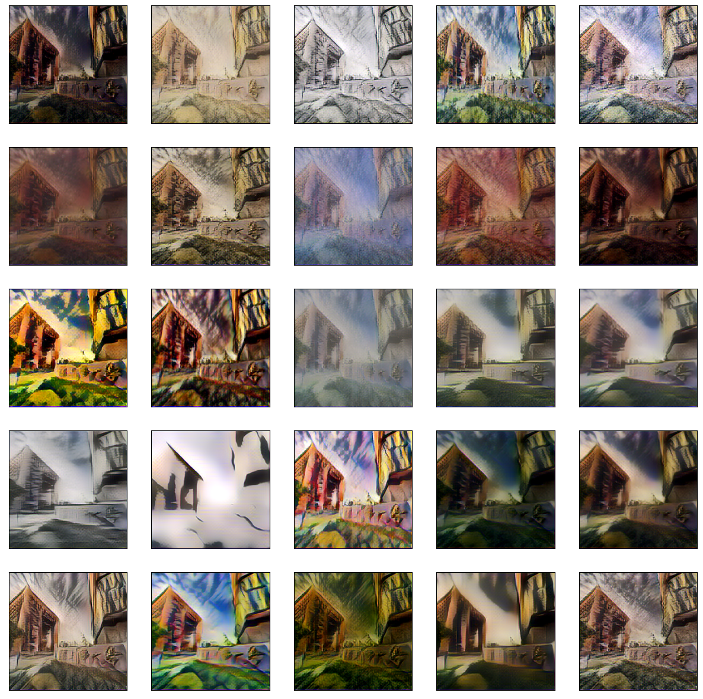

# Style Transfer

The goal of this notebook is to compare 2 different algorithm to implement style transfer, which are A Neural Algorithm of Artistic Style and AdaIN.

## Dataset

The dataset used in this notebook is from mscoco and wikiart: [dataset](https://drive.google.com/drive/folders/1p7iBYILD1ctdl2zmhA1zmBZPgSpa3Zph)  
Other than those datasets, we will also use a original image to apply our style transfer:

## How To Run?
Language: Python 3+  
Recommended way of running: use the `jupyter notebook` command

## Result

The result of applying different styles to our original image:

